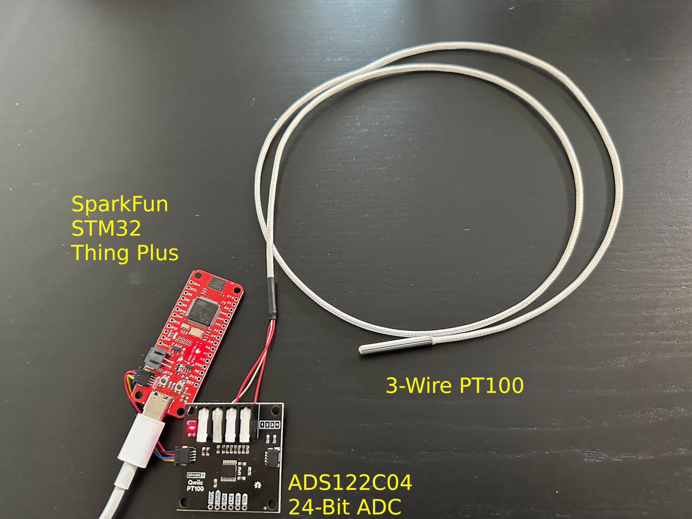

# ADS122C04 ADC MicroPython Library
Library for interacting with this 24-bit ADC IC: ADS122C04. SparkFun has a SparkX [product](https://www.sparkfun.com/products/16770) which has this chip on a board, with connectors for connecting a 2, 3, or 4 pin PT100 Platinum temperature probe.

## Inspired by
This library was written mostly using reference from the SparkFun_ADS122C04_ADC_Arduino_Library: https://github.com/sparkfun/SparkFun_ADS122C04_ADC_Arduino_Library. They did the hard work of throughly reading the IC datasheet and documenting all of the register configuration values. A lot of my time was spent learning how to interact with bitfield using python, and replicating C-language `unions` in Micro-Python using the `uctypes` module.

# Supported Hardware
I've gotten this software running on two micro-controllers running MicroPython:
- RP2040
- STM32

For whatever reason I found the RP2040's I2C to be kind-of flakey, so I ended up switching to the STM32 at the end, which had its own sets of quircks, but at least I2C was reliable.
I have only tested this with a 3-wire PT100 probe, and currently the code is hardcoded for that type of probe.